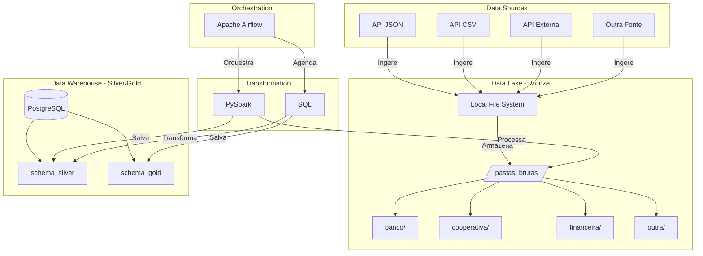

## Visão Geral

Este é um projeto de estudo desenvolvido para explorar e aplicar conceitos de Data Warehouse utilizando a abordagem de *Medallion Architecture*. O projeto tem como objetivo a consolidação dos dados públicos disponibilizados pelo Banco Central, processando-os e organizando-os para análises e geração de relatórios. Esta iniciativa de estudo e experimentação é voltada para a aprendizagem prática de técnicas e tecnologias modernas no gerenciamento e análise de dados. 


## Resumo da Arquitetura do Projeto

O projeto é estruturado em três camadas – **Bronze**, **Prata** e **Ouro** – que garantem a integridade, escalabilidade e o histórico dos dados.


    
---

### Camada Bronze (Data Lake)

**Objetivo:**  
Coletar e armazenar os dados brutos extraídos de diversas APIs, como as fornecidas pelo Banco Central.

**Ferramentas e Tecnologias:**  
- **Linguagem:** Python  
- **Orquestração:** Apache Airflow (DAG de coleta)  
- **Armazenamento:** Estrutura de diretórios no computador local, organizada de forma similar a um data lake

**Características:**  
- Armazenamento dos dados em seu formato original (JSON, CSV, etc.), sem qualquer transformação.  
- Coleta diária dos dados, mesmo que muitos registros se repitam caso não haja alterações.

---

### Camada Prata (Staging)

**Objetivo:**  
Realizar a limpeza, padronização, deduplicação e integração dos dados provenientes da camada Bronze.

**Ferramentas e Tecnologias:**  
- **Linguagem:** Python com PySpark  
- **Transformações:** Aplicação de funções de limpeza (remoção de acentuação, padronização de endereços, etc.) e filtragem de duplicatas em cada carga diária utilizando PySpark.  
- **Armazenamento:** Banco de dados PostgreSQL, atuando como staging para os dados limpos.

**Características:**  
- Processamento diário que remove duplicatas dentro de cada batch, ainda que possa haver registros repetidos entre cargas diárias.  
- Implementação de lógica incremental (ex.: utilizando hash dos registros) para identificar novos dados e alterações, preparando os dados para a modelagem histórica.

---

### Camada Ouro (Data Warehouse)

**Objetivo:**  
Modelar os dados finais para análise e consumo por ferramentas de BI, aplicando a lógica SCD Tipo 2 para manter o histórico completo das alterações.

**Ferramentas e Tecnologias:**  
- **Linguagem:** SQL (com possibilidade de uso do dbt para transformação e versionamento dos modelos)  
- **Banco de Dados:** PostgreSQL, com tabelas finais organizadas em um esquema dimensional (tabelas fato e dimensões)

**Características:**  
- Aplicação da lógica SCD Tipo 2 para atualização dos registros, mantendo o histórico através de colunas como data de início e data de término.  
- Otimização para consultas e análises, servindo de base para dashboards e relatórios.

---

## Outras Tecnologias e Habilidades Utilizadas

- **Apache Airflow:** Orquestração das DAGs para coleta (Camada Bronze) e transformação dos dados.  
- **PySpark:** Processamento distribuído dos dados, utilizado para demonstrar habilidades em Big Data.  
- **SQL:** Utilizado tanto na transformação (via dbt ou scripts SQL) quanto na modelagem final do Data Warehouse.  
- **dbt (Data Build Tool):** Considerado na etapa de transformação da Camada Prata para Ouro, promovendo boas práticas de versionamento, testes e documentação dos modelos.  
- **PostgreSQL:** Banco de dados utilizado para as camadas de staging (Prata) e final (Ouro).  
---
```mermaid
flowchart TD
    %% Camada Bronze - Raw Data
    A[Data Bruta<br/>(Arquivos locais - Data Lake)] 

    %% Camada Prata - Staging
    B[Processamento e Deduplicação<br/>(PostgreSQL - Camada Prata)]
    
    %% Camada Ouro - Data Warehouse
    C[Data Warehouse<br/>(PostgreSQL - Fatos e Dimensões)]
    
    %% Pipeline de ETL e Transformação
    D[PySpark<br/>(ETL para Camada Prata)]
    E[dbt + SQL<br/>(Modelagem para Camada Ouro)]
    
    %% Análise e Visualização
    F[Python/Pandas<br/>(Análise Exploratória)]
    G[BI / Visualizações]
    
    %% Conexões entre as camadas
    A --> D
    D --> B
    B --> E
    E --> C
    
    %% Fluxo de Análise
    A --- F
    C --- F
    F --> G
    
    %% Notas de migração futura
    H[Versão 2: Migração para Cloud<br/>(Ex.: Azure Data Lake, Azure Synapse)]
    C --- H
```

Este projeto é uma iniciativa de estudo e experimentação, voltada para a aprendizagem prática de técnicas e tecnologias modernas no gerenciamento e análise de dados. As escolhas tecnológicas foram fundamentadas na relevância e aplicabilidade em cenários reais, contribuindo para o desenvolvimento de habilidades essenciais na área de Data Warehouse.


  
  <br>
<p align="center">
  <em>Primeira versão do esquema estrela do Data Warehouse.</em>
</p>


